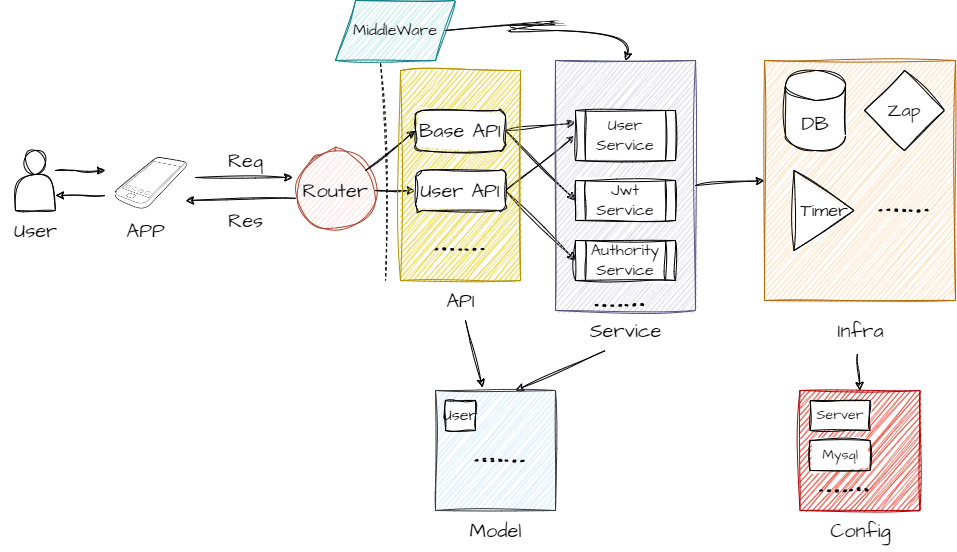

# 项目架构与数据结构说明

## 1. 概述

本文档是对项目的架构和数据结构进行说明，主要包括项目的整体架构、数据结构、数据流等内容。

- 项目名称：悦动健身APP-后端
- 项目描述：悦动健身APP是一款健身类APP，主要提供健康、运动、我的三大模块，用户可以在APP上查看健康资讯、制定运动计划、记录运动数据等。
- 项目当前版本：v0.1

## 2. 项目架构

项目采用go语言开发，采用gin框架，项目整体架构如下：

```
D:.
├─annex
├─api
│  └─v1
│      ├─app
│      └─system
├─config
├─core
│  └─initialize
│      ├─app
│      └─system
├─deploy
├─docs
├─global
├─log
├─middleware
├─model
│  ├─app
│  ├─common
│  │  ├─gc
│  │  ├─request
│  │  └─response
│  └─system
│      ├─request
│      └─response
├─router
│  ├─app
│  └─system
├─service
│  ├─app
│  ├─oss
│  └─system
├─tasks
└─utils
```

项目大致架构如下图所示：



## 3. 数据结构

根据项目的架构设计，主要分为几大类型的数据结构：

1. Config：配置信息，将配置信息通过yaml文件进行配置，然后通过viper读取配置信息，然后将配置信息映射到结构体中。
   1. 示例：
   ```go
    type Server struct {
	System  System  `mapstructure:"system" json:"system" yaml:"system"`
	MySQL   Mysql   `mapstructure:"mysql" json:"mysql" yaml:"mysql"`
	Redis   Redis   `mapstructure:"redis" json:"redis" yaml:"redis"`
	Email   Email   `mapstructure:"email" json:"email" yaml:"email"`
	JWT     JWT     `mapstructure:"jwt" json:"jwt" yaml:"jwt"`
	Zap     Zap     `mapstructure:"zap" json:"zap" yaml:"zap"`
	Local   Local   `mapstructure:"local" json:"local" yaml:"local"`
	Qiniu   Qiniu   `mapstructure:"qiniu" json:"qiniu" yaml:"qiniu"`
	Captcha Captcha `mapstructure:"captcha" json:"captcha" yaml:"captcha"`
	Cors    CORS    `mapstructure:"cors" json:"cors" yaml:"cors"`
    }
    ```
2. Model：数据模型
   Model主要是对数据库表的映射或者对请求/响应数据的映射。
    1. 请求示例：
    ```go
    // PageInfo structure for paging
    type PageInfo struct {
    Page     int    `json:"page" form:"page" query:"page"`             // Page number
    PageSize int    `json:"pageSize" form:"pageSize" query:"pageSize"` // 每页大小
    Keyword  string `json:"keyword" form:"keyword" query:"keyword"`    // 用于搜索
    }
    ```
    2. 响应示例：
    ```go
    type Response struct {
	    Code    int         `json:"code"`
	    Data    interface{} `json:"data"`
	    Message string      `json:"message"`
    }
   
    func NewResponse(code int, data interface{}, message string) *Response {
        return &Response{
            Code:    code,
            Data:    data,
            Message: message,
        }
    }
    ```
    3. 数据库表映射示例：
    ```go
    type SysUser struct {
	    global.BaseModel
	    UUID        uuid.UUID       `json:"uuid" gorm:"index;comment:用户UUID"`                                                                                                                                                       // 用户UUID
	    Username    string          `json:"userName" gorm:"index;comment:用户登录名"`                                                                                                                                                    // 用户登录名
	    Password    string          `json:"-"  gorm:"comment:用户登录密码"`                                                                                                                                                               // 用户登录密码
	    NickName    string          `json:"nickName" gorm:"default:系统用户;comment:用户昵称"`                                                                                                                                              // 用户昵称
	    SideMode    string          `json:"sideMode" gorm:"default:dark;comment:用户侧边主题"`                                                                                                                                            // 用户侧边主题
	    HeaderImg   string          `json:"headerImg" gorm:"default:https://nimg.ws.126.net/?url=http%3A%2F%2Fspider.ws.126.net%2Fb8e2028eb012fdeed94e007ea8974b07.jpeg&thumbnail=660x2147483647&quality=80&type=jpg;comment:用户头像"` // 用户头像
	    BaseColor   string          `json:"baseColor" gorm:"default:#fff;comment:基础颜色"`                                                                                                                                             // 基础颜色
	    AuthorityId uint            `json:"authorityId" gorm:"index;default:888;comment:用户角色ID"`                                                                                                                                    // 用户角色ID
	    Authority   SysAuthority    `json:"authority" gorm:"foreignKey:AuthorityId;references:AuthorityId;comment:用户角色"`
	    Authorities []*SysAuthority `json:"authorities" gorm:"many2many:sys_user_authority;"`
	    Phone       string          `json:"phone"  gorm:"comment:用户手机号"`                     // 用户手机号
	    Email       string          `json:"email"  gorm:"comment:用户邮箱"`                      // 用户邮箱
	    Enable      int             `json:"enable" gorm:"default:1;comment:用户是否被冻结 1正常 2冻结"` //用户是否被冻结 1正常 2冻结
    }
    ```
3. Middleware：中间件，负责在请求到达处理函数之前或者之后进行一些处理，如日志记录、权限验证等。
4. Service：服务，负责处理数据逻辑，如用户注册、用户登录等。
5. API：接口，负责处理请求和响应，如用户注册接口、用户登录接口等，在此会调用Service层的服务。
6. Router：路由，负责将请求路由到对应的API接口。
   ```go
   type Group struct {
	   System sysrouter.RouterGroup
	   App    approuter.RouterGroup
   }

   var MainRouterGroup = new(Group)
   ```
7. Utils：工具，负责提供一些工具函数，如加密、解密等。

上面提到的服务、接口等一般均为空结构体，接收一定的方法完成特定的功能。
